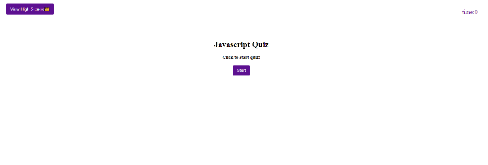
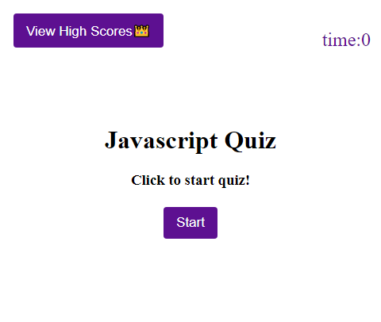
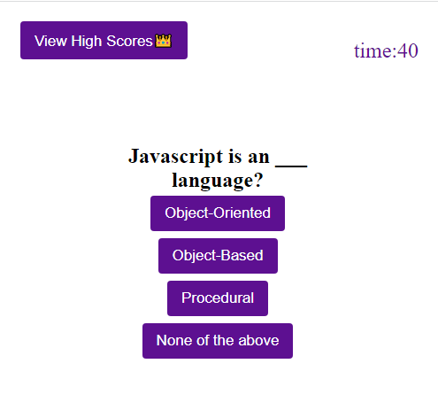
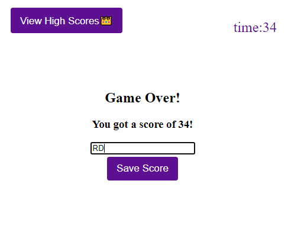
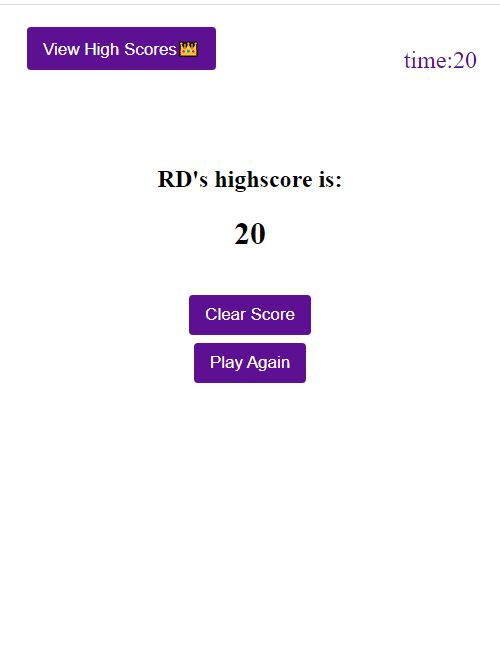

# javascript-quiz

1. Introduction
This code was created using HTML,CSS and Javascript. 
Just a simple little fun quiz about javascripts!

How it looks as on a pc browser.

2. Deployment link
The following link will give you access to the quiz!
https://ryedao.github.io/javascript-quiz/

3. Let's play!

Click start to begin

How it looks scaled down to mobile.

You will be given 75 seconds to do this quiz.

There will be a total of 5 javascript related questions to answer. For every incorrect answer you will be deducted 15 seconds!

There are 4 choices to choose from per question.

User's score will be taken from the time remaining.

At the end of the game you can add your initial to be included in the high score!

You can click high score to see the score!.

